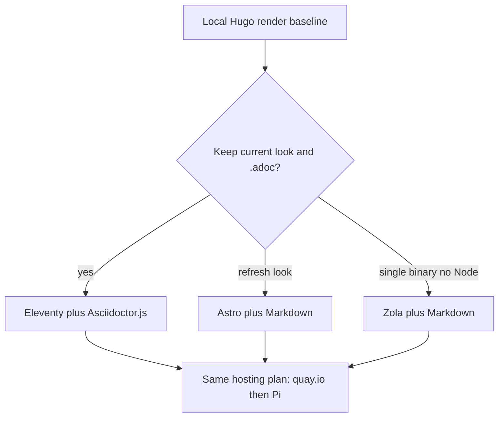

# Replace Hugo without Ruby

Optional side quest. Do this **only after** [self-host-on-hub.md](self-host-on-hub.md) local-dev has a working visual baseline.

Do **not** migrate the generator and build a Hugo production image at the same time. The hosting path (quay.io → Pi Quadlet → Caddy) stays the same; only the build that produces `public/` changes.

## Why replace

The current toolchain is Hugo (old committed `bin/hugo`) plus **Rubygems** (`asciidoctor` in [Gemfile](../../Gemfile), Pygments in CI). Hugo itself is still maintained, but *this* site’s compiler is frozen and the AsciiDoc path is the Ruby dependency to drop.

The site is small: about **15 AsciiDoc posts**, custom [themes/mre.theme](../../themes/mre.theme) (Bootstrap + Go HTML templates), sections `coffee` / `cocktails` / `about` / `music`. Content uses YAML front matter, `<!--more-->`, Hugo `` shortcodes, and AsciiDoc (`==` headings, `NOTE:`, `link:`, `image::`, `[.related]`, `[.ingredients]`, subscripts like `CO~2~`).

## Options (no Rubygems)

**Eleventy (11ty) + Asciidoctor.js** — recommended if you want the current look and to keep `.adoc` files.

- Node, not Ruby. AsciiDoc is compiled by **Asciidoctor.js** ([eleventy-plugin-asciidoc](https://github.com/saneef/eleventy-plugin-asciidoc)), not the `asciidoctor` gem.
- Closest port of today’s layouts: Nunjucks/Liquid HTML can follow the existing Hugo partials (`baseof`, sidebar, list/single).
- Markdown is available later if you convert post-by-post.
- Tradeoff: fewer drop-in “blog themes” than Astro; you mostly bring your own HTML/CSS (which you already have).

**Astro** — recommended if you want a current theme and are willing to rewrite the look.

- Markdown/MDX first, large blog/portfolio theme set, still no Ruby.
- AsciiDoc exists only as a community integration; converting `.adoc` → `.md` is the honest path.
- Theme is components, not a port of `mre.theme`. More work, newer result.

**Zola** — single Rust binary, Hugo-like, no Node and no Ruby.

- Markdown only (CommonMark + shortcodes). Thin theme ecosystem.
- Good if the goal is “one binary, no language runtime.” Requires a full Markdown conversion and a Tera rewrite of the theme.

**Not recommended:** Jekyll (Ruby), “modern Hugo + Markdown” (still Hugo, which this side quest is trying to leave), Antora (docs sites, not a personal blog).

Default recommendation: **Eleventy + Asciidoctor.js**. It drops Rubygems, keeps AsciiDoc, and reuses the existing CSS/layout instead of a redesign. Pick Astro only if a new theme is part of the goal.

## Migration work (Eleventy path)

1. **Freeze the baseline** from `hugo server` (screenshots or a saved `public/` tree) so the new renderer can be compared page-by-page.
2. **Scaffold Eleventy** beside Hugo (`package.json`, `eleventy.config.js`) without deleting Hugo until the new output matches.
3. **Port layouts** from [themes/mre.theme/layouts](../../themes/mre.theme/layouts) to Nunjucks: sidebar nav, home “Daily Specials”, section lists, single posts, About. Reuse existing CSS under `themes/mre.theme/static/css` as Eleventy passthrough copy.
4. **AsciiDoc pipeline:** Asciidoctor.js with the same attributes you rely on (`NOTE` admonitions, `link:` macros, role classes `.related` / `.ingredients` / `.author-bio`). Map Hugo `` to either native `image::` or a small Eleventy shortcode.
5. **Collections** for `coffee` and `cocktails` from folder structure + front matter (`title`, `date`, `image`, `draft`). Preserve `<!--more-->` summaries or replace with an explicit `description`.
6. **Site config** from [config.toml](../../config.toml): title, quote, nav links, social, `baseURL`.
7. **Switch local-dev** (`scripts/dev.sh` / `Containerfile.dev`) from `hugo server` to `npx @11ty/eleventy --serve`. Then the hosting plan’s production image becomes `node` build → nginx, with **no Ruby stage**, still pushed to `quay.io/<namespace>/coffee-site`.
8. Remove Hugo (`bin/hugo`, `config.toml` theme wiring, unused theme submodules) only after the new site matches the baseline.

Astro/Zola would replace steps 2–4 with Markdown conversion plus a new theme, which is a larger content+design pass on the same 15 posts.

## Conversion notes if you choose Markdown

Keep YAML front matter. Typical replacements:

- `== Heading` → `## Heading`
- `NOTE: …` → blockquote or a small “note” component
- `link:url[label]` → `[label](url)`
- `CO~2~` → `CO2` or `CO2`
- `[.related]` / `[.ingredients]` → Markdown + CSS classes in the template
- `` → ``

Fifteen posts is a short, scriptable conversion with a manual proofread for admonitions and recipe lists.

## How this hooks into hosting

Local-dev still comes first (Hugo baseline in [self-host-on-hub.md](self-host-on-hub.md) work package 0). If this side quest is accepted, skip “multi-stage Hugo image” in that plan and package the new generator instead. Caddy, Quadlets, quay.io, DDNS, and DNS cutover do not change.

## Sub-agent task split

| Task | Repo | Depends on |
| --- | --- | --- |
| Freeze Hugo baseline | coffee-site | Hosting plan local-dev green |
| Pick generator (Eleventy vs Astro vs Zola) | coffee-site | Human decision |
| Eleventy: port theme + Asciidoctor.js | coffee-site | Baseline frozen; Eleventy chosen |
| Astro/Zola: convert ~15 posts to Markdown + new theme | coffee-site | Baseline frozen; Astro or Zola chosen |
| Point local-dev script + production Containerfile at new generator | coffee-site | New site matches baseline |
| Resume hosting plan from quay.io push | coffee-site + hub | Generator swap done |
