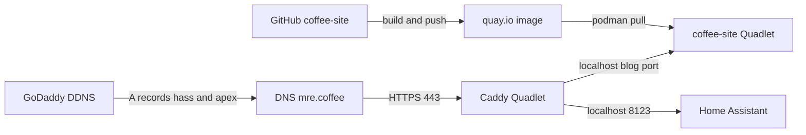

# Self-host mre.coffee on the home-automation hub

Proposal of work for this repository and [home-automation-hub](https://github.com/etsauer/home-automation-hub). Not an implementation commit.

Related optional plan: [replace-hugo.md](replace-hugo.md) (generator swap, no Rubygems). Do that **after** local-dev, and **instead of** packaging Hugo — not in parallel.

Two repos stay in their current roles:

- **coffee-site** owns content and the container image.
- **home-automation-hub** owns how it runs on the Raspberry Pi (Podman Quadlets, Caddy, DNS).

## Current state

This repo is a static Hugo + AsciiDoc site (`theme = "mre.theme"`, `baseURL = "http://mre.coffee/"`). There is no app server — only generated HTML/CSS/JS.

Build/publish today:

- [`.github/workflows/publish.yaml`](../../.github/workflows/publish.yaml) builds the production `Containerfile` (`linux/amd64` and `linux/arm64`) and pushes to `quay.io/etsauer/coffee-site`.

[home-automation-hub](https://github.com/etsauer/home-automation-hub) already has the runtime to match:

- Podman + systemd Quadlets, deployed by Ansible `ansible/site.yml`
- Caddy on `Network=host`, TLS for `hass.mre.coffee` → `localhost:8123`
- GoDaddy DDNS updating only the `hass` A record on `mre.coffee`

A static blog is tiny compared to Frigate. Home Assistant is already public on this Pi, so adding another Caddy site is a small extra surface — as long as the blog container is **localhost-only** and Frigate stays unpublished.

## Decision point after local-dev

Once the site renders locally, choose one:

- **Stay on Hugo** and continue this plan (production image → Pi).
- **Switch generators** using [replace-hugo.md](replace-hugo.md), then package *that* output instead.

## Target shape

**coffee-site** produces `quay.io/<namespace>/coffee-site:<tag>` (fill in the Quay organization or username you already use):

- Multi-stage **Containerfile**: Hugo + Asciidoctor/Pygments build, then a small nginx serving `/public` on port 80 inside the container. Build with Podman (not Docker).
- Pin a Hugo version in the Containerfile (replace the committed `bin/hugo` rather than copying it). Confirm the current binary still builds, then pin that or the nearest still-working release. This theme’s `min_version` is `0.36.1`, so a jump to modern Hugo may need a small content/theme fix.
- GitHub Actions: on `main`, `podman build` (or Buildah) for `linux/arm64` (optionally also `amd64`) and `podman push` to **quay.io**. Drop the S3 sync job.
- Auth: a Quay robot account stored as GitHub Actions secrets (e.g. `QUAY_USERNAME` / `QUAY_PASSWORD`); log in with `podman login quay.io`.

**home-automation-hub** runs it like Home Assistant:

- New Ansible role (e.g. `coffee_site`) that writes a Quadlet under `/etc/containers/systemd`, pulls the quay.io image, and publishes **only** `127.0.0.1:<port>:80`.
- Extend the Caddy role from a single `caddy_domain` to **multiple site blocks**: keep `hass.mre.coffee` → HA; add `mre.coffee` (and optionally `www.mre.coffee`) → the blog port. Caddy already terminates TLS.
- Extend GoDaddy DDNS so it keeps **apex** `mre.coffee` (and `www` if used) pointed at the home IP, not only `hass`.
- Follow the hub’s existing safety path: local `test-coffee-site.yml` rehearsal, write-only default, `--check --diff` on the Pi, then enable in `site.yml` only after a known-good cutover.

If the Quay repository is private, add a pull credential to hub `secrets.yml` (not committed) so the Pi can `podman pull`. A public repo is simpler.

Do **not** put Frigate (or MQTT) on a public hostname.

## Work packages

### 0. Local dev mode (coffee-site) — do this first

Prove the current Hugo + AsciiDoc site actually renders before any production packaging. This is **not** the multi-stage image.

Recommended shape: a **Podman** local-dev image from `Containerfile.dev` that bind-mounts the repo and runs `hugo server` with live reload on `http://localhost:1313`. Put Asciidoctor/Pygments *inside that container* so the host does not need Rubygems. Do **not** use Docker or docker-compose. A native `bundle install && bin/hugo server` path can exist as a fallback, but the committed `bin/hugo` is an old ~18MB binary and is the fragile part.

Concrete work:

- Add `Containerfile.dev` whose only job is “Hugo + Asciidoctor, `hugo server --bind 0.0.0.0`”, plus a small `scripts/dev.sh` that `podman build`s and `podman run`s it.
- Identify and pin the current `bin/hugo` version (`hugo version`) so the dev image matches what used to publish to S3. **Done: local-dev now runs Hugo v0.165.0** (see upgrade notes below), not the committed 0.54 binary.
- Fix whatever blocks a clean render (missing `bin/hugo` locally, theme/static paths, AsciiDoc `NOTE:` / `image::` / `` shortcodes, images under `static/` or page bundles).
- Update [README.md](../../README.md) to a one-command local run (`./scripts/dev.sh`).
- **Acceptance:** home, a coffee post (e.g. beginners guide), a cocktail recipe, About, and at least one image each look right in the browser. Compare against the live S3 site if it is still up. That browser pass is the visual baseline for both packaging and any later generator swap.

Do **not** change `baseURL` to HTTPS, delete `bin/hugo`, or add a production nginx stage in this step.

#### Hugo 0.54 → 0.165 (done in local-dev)

Tried current Hugo (**v0.165.0**, 2026-08-12). The site builds and renders after these changes:

- Drop removed `_internal/google_analytics_async.html` and the dead `UA-` config key.
- Replace deprecated `languageCode` / `.Site.LanguageCode` with `locale` / `.Site.Language.Locale`.
- Allow `asciidoctor` and `GEM_*` / `RUBY*` env in `[security.exec]` (Hugo 0.91+ sandbox).
- Fix a malformed `` shortcode (`flair-espresso.adoc` and the coffee archetype).
- Remove draft stub `content/coffee/_index.adoc` so `/coffee/` lists posts and `content/coffee/img/` is published (a draft `_index` made coffee a branch bundle and 404ed the section).
- Homepage grid: use `site.RegularPages` on home (`portfolio.html`). `.Pages` on home is empty in current Hugo.
- Homepage `<title>` falls back to `.Site.Title`.
- Image tarball is now `hugo_${VER}_linux-amd64.tar.gz` (not the old `Linux-64bit` name). Pygments is unused (Chroma is built in).

Still leftover later: unused theme submodules, Font Awesome webfonts looking empty in the sidebar. `bin/hugo` is removed; CI builds the production `Containerfile`.

### 1. Containerize the site (coffee-site)

Only after step 0 is green (and only if staying on Hugo):

- Add a **separate** multi-stage `Containerfile` (build → static nginx). Reuse the same pinned Hugo/Asciidoctor versions that worked in dev. Build and run with Podman.
- Set `baseURL` to `https://mre.coffee/` for the production build (dev server should keep using localhost).
- nginx:alpine is enough for static files; Caddy-in-the-app-container is redundant because the hub Caddy already does TLS.

### 2. Replace S3 publish with image publish (coffee-site)

**Done in this repo:** GitHub Actions builds/pushes `quay.io/etsauer/coffee-site` (`linux/amd64` + `linux/arm64`). Travis and S3 deploy are removed. Rotate any leftover AWS keys that used to live in Actions or Travis.

Remaining: confirm the Quay repo name/namespace if it is not `etsauer/coffee-site`.

### 3. Hub role + Caddy vhost (home-automation-hub)

This work lives in the hub repo, not here.

- New Quadlet role mirroring the hub’s `caddy` / `homeassistant` roles: templates, defaults, `*_manage_service`, rehearsal playbook.
- Multi-site Caddyfile (this is the main hub change — today’s role is single-domain `hass.mre.coffee`).
- Image: `quay.io/<namespace>/coffee-site`. Public is simplest; if private, add a pull credential to `secrets.yml`.

### 4. DNS and cutover

- Point `mre.coffee` A (and `www` if desired) at the same home IP DDNS already maintains for `hass`.
- Keep S3 up until HTTPS for `mre.coffee` via Caddy is verified (Let’s Encrypt needs the new A record to hit the Pi).
- Optional: redirect `coffee.etsauer.com` → `mre.coffee`, or leave it until the S3 bucket is emptied.
- Lower TTL before cutover if GoDaddy still has a long TTL on the apex record.

### 5. Verify and decommission

- Hit `https://mre.coffee/` from outside the LAN; confirm HA at `hass.mre.coffee` still works.
- Empty/disable the S3 buckets and the Actions S3 secrets.
- Hygiene that is **not** required to go live: unused theme submodules, Universal Analytics (`UA-126144146-1`), Disqus/Formspree staying third-party.

## Risks to treat as first-class

- **Hugo version drift** — the committed binary is the known-good compiler; pin it or budget a small rebuild-fix pass.
- **Caddy multi-site edit** — a bad Caddyfile takes down HA TLS; rehearse and `--check --diff` before restart.
- **Apex DNS** — DDNS today only updates `hass`; without an apex updater, `mre.coffee` will stay on S3.
- **Pi architecture** — image must be `linux/arm64` (or the Pi’s actual arch).
- **Let’s Encrypt rate limits** — don’t flap the Caddyfile/domain during bring-up.
- **Quay auth** — CI needs a robot account with push; the Pi needs pull (anonymous if public).

## Suggested sequence

1. **Local-dev Podman** (`Containerfile.dev` / `./scripts/dev.sh`) renders the current site in a browser (visual baseline).
2. Optional: take [replace-hugo.md](replace-hugo.md) instead of packaging Hugo.
3. Production multi-stage image builds from the same pinned toolchain (or from the new generator).
4. Actions pushes `linux/arm64` to quay.io.
5. Hub role rehearsed; Quadlet runs on the Pi bound to localhost (HTTP only).
6. Caddy site + apex DDNS; TLS comes up.
7. DNS cutover; S3/Travis/AWS keys retired.

## Sub-agent task split

| Task | Repo | Depends on |
| --- | --- | --- |
| Local-dev Podman (`Containerfile.dev`) + browser verify | coffee-site | — |
| Production Containerfile | coffee-site | Local-dev green; not doing Hugo replacement |
| Actions → quay.io | coffee-site | Production image builds locally |
| Quadlet role | home-automation-hub | Image exists on quay.io |
| Caddy multi-site | home-automation-hub | Quadlet listens on localhost |
| Apex DDNS | home-automation-hub | Independent of image, needed before public TLS |
| DNS cutover / retire S3 | both | TLS verified |
